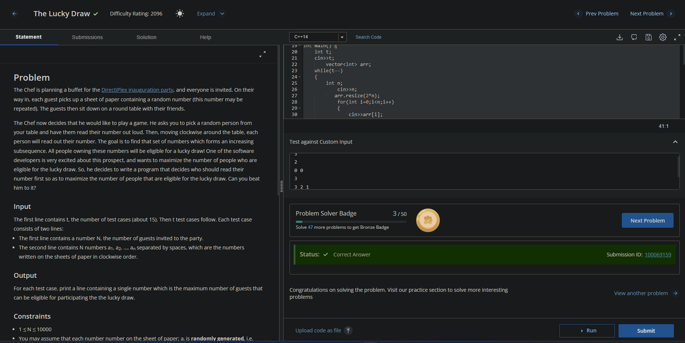
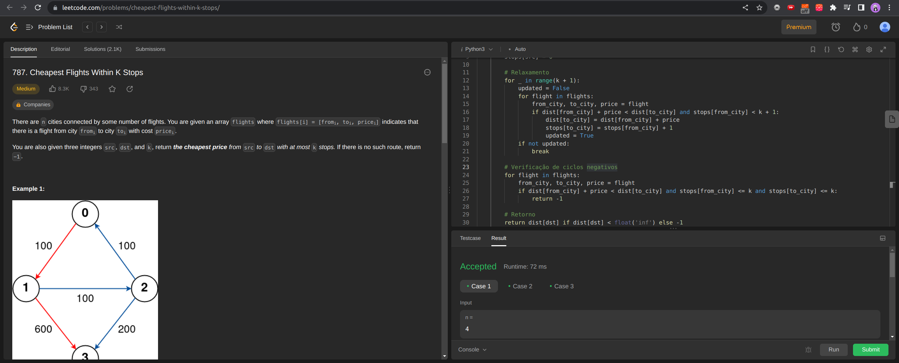

# ProgDinamica-G4
Repositório  com exercícios do módulo de Programação Dinâmica da disciplina de Projeto de Algoritmos.

**Número da Lista**: 5 
**Conteúdo da Disciplina**: Programação Dinâmica 

## Alunos
| Matrícula | Aluno |
| -- | -- |
| 17/0107574  |  Laís Ramos Barbosa     |
| 21/1031833  | Taynara Cristina Ribeiro Marcellos  |

## Sobre 

Os enunciados dos 4 exercícios podem ser encontrados na listagem abaixo:

- [The Lucky Draw 
](https://www.codechef.com/problems/D2) : Resolvido através do algoritimo da maior subsequência crescente
- [Repeated DNA Sequences
](https://leetcode.com/problems/repeated-dna-sequences/): Resolvido através do algoritimo de alinhamento de sequência
- [Cheapest Flights Within K Stops](https://leetcode.com/problems/cheapest-flights-within-k-stops/) : Resolvido através do algoritmo de Bellman-Ford
- 

## Screenshots

Figura 1 - The Lucky Draw.

Figura 2 - Cheapest Flights Within K Stops.

## Instalação 

**Linguagem**: e C++ 

### Instalação do Python

Para instalar  no **Windows**, siga o tutorial a seguir:
- [Python no Windows](https://www.python.org/downloads/windows/)

Para instalar  no **Linux**, siga o tutorial a seguir:
- [Python no Linux](https://python.org.br/instalacao-linux/)

### Instalação do C++

É necessário ter pré-instalados e configurados na sua máquina:
- [gcc](https://gcc.gnu.org/);

No **Linux**, para instalar o **g++**, execute o seguinte comando:

    sudo apt-get install build-essential

## Uso 

Após instalar as dependências do projeto, realize os seguintes comandos: 

    git clone git@github.com:projeto-de-algoritmos/ProgDinamica-G4.git

### Uso dos exercícios em 

Agora o seu ambiente agora está configurado. Para testar os 2 exercícios desenvolvidos em , que estão nas pastas nomeados de:
- 
- 

Basta entrar na pasta do exercício e digitar os comandos:

   cd <nomePasta>
    python3 test1.py
    python3 test2.py
    
    

Pronto! O código está rodando e os exercícios podem ser testados.

### Uso dos exercícios em C++

Agora o seu ambiente agora está configurado. Entre na pasta no qual deseje testar um exercícios dentre os disponibilizidos. Basta entrar na pasta do exercício e digitar os comandos:

    cd <nomePasta>
    g++ <nomeArquivo>.cpp
    ./a.out < test1.txt
    ./a.out < test2.txt
    ./a.out < test3.txt

Pronto! O código está rodando e os exercícios podem ser testados.
